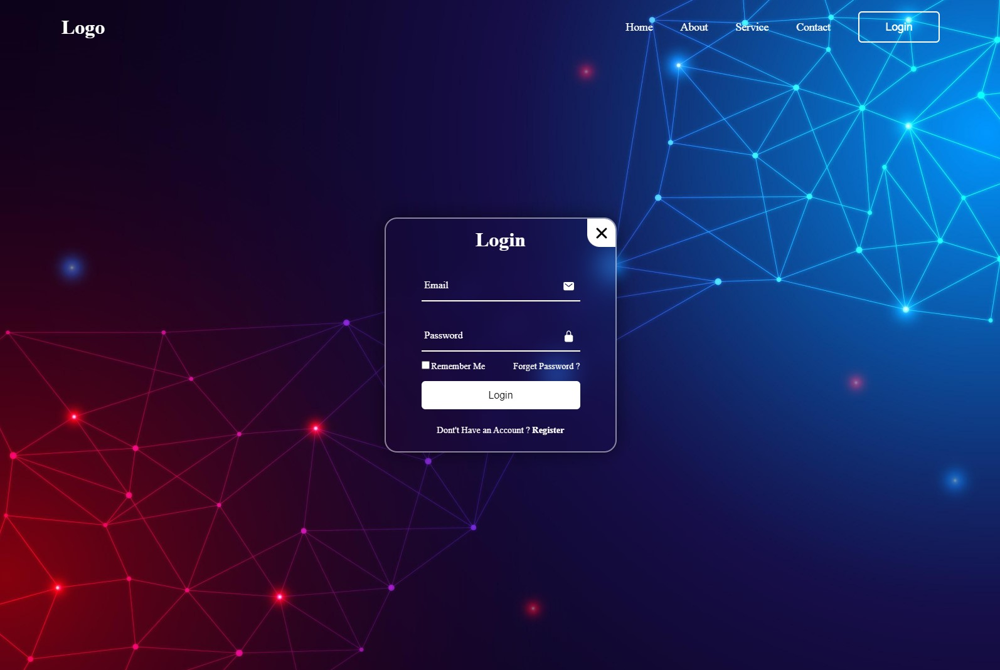
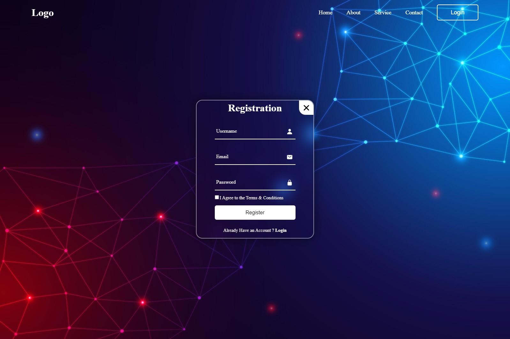

<h1 align="center">
  🔐 Responsive Login Page
</h1>

<p align="center">
  A sleek and modern responsive login page built using HTML, CSS, and a bit of magic 🪄. <br>
  Perfect for web apps, landing pages, or any project requiring user authentication UI.
</p>

<p align="center">
  
  
</p>

---

## 🖼️ Preview





---

## 🌟 Features

- ✅ Fully responsive layout (mobile-friendly)
- 🎨 Modern and clean design
- 👁️ Eye-catching button & input animations
- 🌙 Light/Dark style adaptable (customizable)
- 💡 Easy to integrate into any web project

---

## 🛠️ Technologies Used

| Tech      | Description         |
|-----------|---------------------|
| 🔤 HTML5  | Structure/Markup     |
| 🎨 CSS3   | Styling & Animations |

---

## 🚀 Getting Started

### 1. Clone the Repository

```bash
git clone https://github.com/Psychokiller70/Login_responsive_page.git
cd Login_responsive_page


